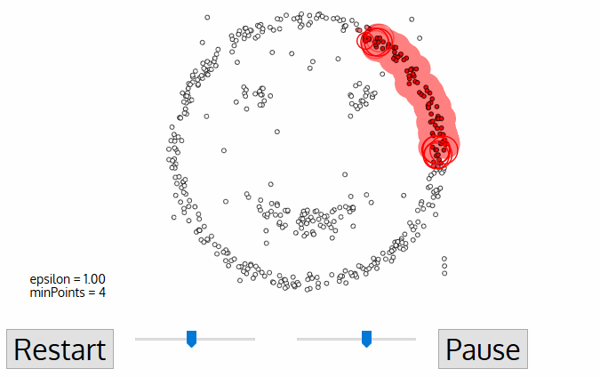

# [fit] Odd one out


^ Transition words: However, But, 

^ Hello everyone! My name is Kevin Glisson, I'm a Senior Security Engineer @ Netflix. I am a member of our Security Incident Response Team (SIRT). 

^ Today we're going to be chatting about Netflix's approach to scoping a security incident in the cloud and a tool that we've built to help us.

^ First, let me briefly set the stage:

^ 	- We respond in highly dynamic environments

^	- Our flat company culture has little in the way of top down management

^   - Organizationally, my team (SIRT) is responsible for Crisis Management, Intelligence and Detection. All this in addition to classic Digital Forensics and Incident Response.

^ We're pretty busy... Forward!

---

# Do you know what's __*normal?*__


^ For us, the very first step in scoping incident is asking ourselves:

^	- Do we know what's normal?

^ It's nice to have some prior knowledge when possible, be prepared:

^ 	- Do we know how code is deployed?

^ 	- Do we know how long servers live?

^ 	- Do we know how software is updated?

^ But all of the pre-work is in the world won't elminate unknowns:

^ 	- New environments

^	- New partners

^	- New technologies

^ In our view good tooling should be flexible, limit assumptions and be useful in many different situations. The goal is to speed up the process of turning unknowns into knowns.

---

# Feel the churn


^ Now we know what to ask, here's what we do know about the environment @ Netflix:

^ 	- We have hundreds of AWS accounts

^	- We have 100k+ instances

^ Our developers fully embrace continuous deployment and continous integration, this leads to:

^	 - Thousands of production deployments a day

^	 - Avg instance life time ~ 2days

^ The average instance lifetime is only getting shorter, as our container deployments increase in size we expect days to turn into hours and then to into minutes. 

^ Everything is a moving target.

---

# Immutable Servers

## Don't let things get stale. 


^ What else do we know about on environment? We know that are instances are "immutable".

^ What does immutable mean? It means that instances under go the process of "baking". 

^ The baking process takes application code and installs it onto a standard image.

^ A new image is produced. This image does not fundamentally change. 

^ This immutablbility ensures every time that image launched it is no different than any of it's peer's.

^ It also ensures every instance is disposible, there are no special snowflakes here.

^ This imutability is important, instances are created and deleted all the time.

^ 	- Due to autoscaling

^   - Bad hardware

^	- Human interaction

^ Developers are in full control of their applications, anything that can happen, will happen.

------------------


<br>

<br>

<br>

<br>

<br>

<br>

# Ship-it

^ We also know how software is updated:

^ We don't patch, we replace. Immutability forces this. 

^ Replacement is done via Blue/Green deployments, this allows for:

^ 	- Traffic to be easily canaried (small clusters, reciving a small percentage of production traffic).

^ 	- Rolled back, in case of issues.

------------------------

<br>

<br>

# The Paved Path
### Don't go it *alone*. 


^ We know that we provide tooling and support for the paved path. This path is not "enforced" or "mandated".

^ We (security) aim to the make that path as easy and convient as possible. 

^ Developers should choose the paved path because its the easiest and most productive way to accomplish a task. Not because they have to.

^ Incident response is no different

^ A incident response paved path means:

^	- Clear communication about a developer's responsibility during an incident.

^	- Incident response tooling is exposed to developers, to empower and to speed up collection of forensic data.

^ We view incident response as a customer focused service. 

---

# [fit] Trust but verify

### Know a lot, ask for more. 

^ We know a lot about of metadata about the cluster itself:

^	- Deployment information (when was this instance deployed, by whom)

^ 	- Package information (what packages & versions are deployed)

^	- Code currently deployed (via git commit hash)

^	- AWS API calls made (cloudtrail)

^	- CPU/Memory and other performance related metrics (cloudwatch)

^	- Access logs

^ But we don't know everything, things change.

^ To close the gap, we interrogate instances for missing or highly dynamic information.

^	- We do this when we know an instance is not compromised, i.e during the deployment process. We build these security questions into our CI/CD pipelines. 

---

<br>

<br>

<br>

# Outliers



### Baseline & Cluster Analysis is your friend.

^ When we know as much as possible, we look inward. 

^ Two approaches:

^	Baseline analysis

^		- Good for when you have information from "clean" or known good state.

^	Cluster analysis

^		- Good for when no clean state is available, determine who stands out in a crowd.

^		- Note: Cluster analysis only works well on larger clusters, not as well on smaller cluster. Data could also be questionable if every instance could be compromised. In our environment we think this is unlikely as an attacker would have to continually re-compromise a host. Instance lifetime limits persistence and ability to pivot, requires a highly active attacker. 

^ Be smart about feature engineering, are there queries that are more useful in one context than another? 

^ Given the information at your disposal, are there any new facts that differ from normal. Are they suspicious by themselves? 

^ Suspicious in the context of other information. i.e. known vulnerability + new listening high port

---

# 


<br>

<br>

<br>

<br>

<br>

<br>

# Diffy

## Evil mustache? 

^ For us, today, diffy acts as a way to quickly scope potential compromise during an incident.

^ It attempts to scope incidents by identifying instances that are outliers among a cluster of machines.

^ It does so either via baseline analysis (if available) or cluster analysis if no baseline is available.

^ Not everything interesting during an incident will have a normal baseline. Diffy's main value is it allows us to limit deep forensics to only the most valuable sources of data.

^ It's a trade-off between being comprehensive and being fast. Remeber our instances don't stick around for too long. Quarantine is an option, but for 1,000 instances? Probably not. Get in, pick high value targets and get out. 

^ A standard query pack allows Diffy to kick off our forensic collection pipeline on abnormal instances. 

^ Analogy; if you are looking for a needle in the haystack use a magnet. If the magnet doesn't work burn the haystack to the ground. 

---

# Un-opinionated

- Plugin based
- Cloud friendly
- Bring your own analysis

^ We strived to make diffy as flexbile as possible. At it's core is really just a framework for command execution and result comparison.

^ We've believe that no tool survives contact with an incident. 

^ Each are unqiue, each have unexpected challenges. 

^ The goal is to make diffy a useful tool in the largest percentage of incidents we can. We do this through extensive use of plugins. 

-------------

# [Fit] Imagine a world...

### Or just follow [@**ProjectZeroBugs**](https://twitter.com/ProjectZeroBugs)

^ You have 100 servers that are vulnerable to struts2. You have to determine which to do deeper forensics work on.

^ Actually not hard to imagine… super easy, happends all the time.

----------

# Our forensics pipeline game is strong but...


^ We try to automate everything, but theres always a cost.

^ That's a lot of data (potentially):

^	- Most of which probably isn't relevant

^	- Could take a lot of time to collect, organize, store, search etc.,

^ Where to start? There's no baseline for this but attackers are pretty lazy:

^ 	- Listening on a port nobody else is?

^ 	- Running a process nobody else is?

^ 	- Has a cron job nobody else does?

-----------

## CLI

```bash
$ diffy --target-key api-v001 --accountNumber 1234567890 --region us-east-1
```

## HTTP POST

```json
{
	"incidentId": "DiveDiveDive",
	"collectionPlugin": {
		"options": {
			"region": "us-east-1",
			"account_number": "1234567890"
		}
	},
	"targetPlugin": {
		"options": {
			"region": "us-east-1",
			"account_number": "1234567890"
		}
	},
	"targetKey": "api-v100"
}
```

------------

# [fit] Wait, how does this work? 

<br>

# Command -> Result -> __*Magic*__

^ Diffy issues commands through a command transport (ssm, ssh, etc.,).

^ Payloads (many commands) are used to to setup an environment, tear down an environment

^ Collects responses and compares against a baseline, or attempts to cluster. 

-------

# [Fit] Isn't this just detection?   


^ Yes and No, while Diffy (or other systems) could be setup to create and process similar data on an ongoing basis (like osquery kolide). We're just not ready yet. 

^ Diffy is valuable to us now and that's enough. 

^ We believe there are others in similar situations, where diffy might be useful for them too.

---------

# TODO

- Example clustering implementation
- Documentation
- Tests
- More plugins!

^ Is this a useful approach? 

^ Would could this work in your organization? If not, why not?

---------------------

# The Goods

- Source 
  - https://github.com/Netflix-Skunkworks/diffy
- Techblog 
  - https://medium.com/netflix-techblog
- Presentation	 Notes (actual content!) 
  - https://github.com/kevgliss/diffy-presentation 


^ We <3 open source

^ High tides lift all boats

^ Looking for interesting incident response challenges, join us!

^ Also sickers, lots and lots of stickers.


-------------

# [fit] Thank you